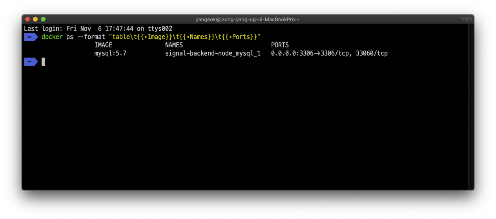

# Signal Project Configuration

## [Frontend](https://github.com/Signalbiz/SIGNAL_VUE)

## [Backend](https://github.com/Signalbiz/SIGNAL_REST_NODE)

### Database

- `docker-compose-dev.yml` 파일로 컨테이너를 구동합니다.

```sh
// using foregorund mode
docker-compose -f ./docker-compose-dev.yaml up

// using background mode
docker-compose -f docker-compose-dev.yml up -d
```

- 실행중인 컨테이너 중 mysql이 돌고 있는 컨테이너의 이름을 확인합니다.

```sh
docker ps --format "table\t{{.Image}}\t{{.Names}}\t{{.Ports}}"
```



- 이름을 확인했으면 다음과 같이 컨테이너에 접속합니다.

```sh
docker exec -it signal-backend-node_mysql_1 /bin/bash
```

- mysql에 접속합니다.
- 데이터베이스를 직접 만들어줍니다.

```sh
CREATE DATABASE IF NOT EXISTS 1min;
```